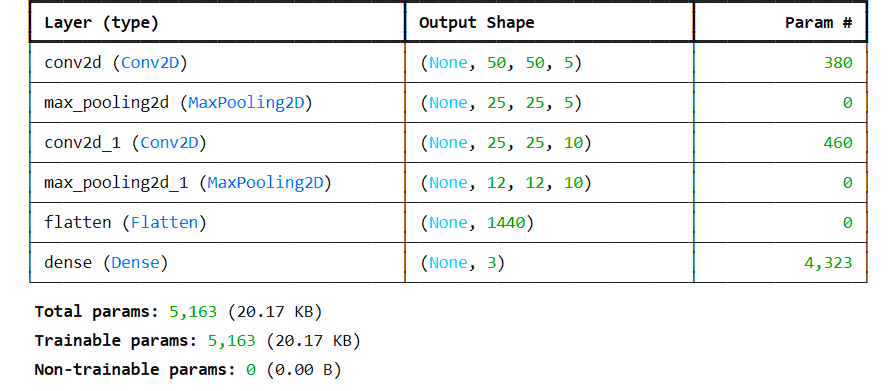
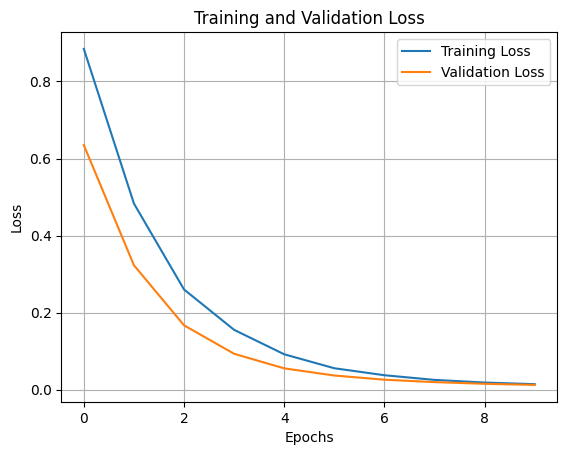
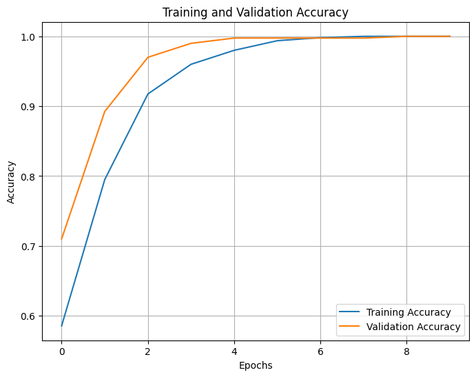

# ASL Letter Recognition Using CNN 🤟

This project utilizes a convolutional neural network (CNN) to classify images of American Sign Language (ASL) letters. By training a model on labeled ASL images, this project takes the first step toward building systems capable of translating sign language into text or speech.

# Why This Project Matters 🌟

> ### Problem

Sign language is a primary communication medium for the deaf and hard-of-hearing communities. However, a communication barrier often exists between individuals fluent in sign language and those who are not.

> ### Solution

This project reduces this barrier by using computer vision to recognize individual ASL letters. The foundation laid here can be expanded into sentence-level translation systems to make sign language more accessible.

# Technologies Used 💻

This project uses a variety of technologies to achieve high accuracy and efficient performance:

## Core Technologies

1. <mark>TensorFlow/Keras:</mark> Used to build and train the CNN model for ASL letter recognition.

2. <mark>NumPy:</mark> For efficient numerical computations and data preprocessing.

3. <mark>Matplotlib:</mark> To visualize training performance metrics and misclassified examples.

## Dataset Handling

4. <mark>Custom Dataset Loading:</mark> ASL dataset loaded via sign_language.load_data() function.

5. <mark>One-Hot Encoding:</mark> Used to encode class labels ('A', 'B', 'C') for compatibility with TensorFlow/Keras.

## Training and Optimization

6. <mark>Adam Optimizer:</mark> For fast and efficient optimization during training.

7. <mark>Callbacks:</mark>
   - <mark>ModelCheckpoint:</mark> To save the best model based on validation loss.
   - <mark>EarlyStopping:</mark> To avoid overfitting by halting training early.
   - <mark>ReduceLROnPlateau:</mark> To dynamically adjust learning rates during training.

# Data Overview 📊

The dataset consists of labeled images of ASL letters:

| Letter  | Training Images | Test Images |
| :-----: | :-------------: | :---------: |
| A       | 540             |   118       |
| B       | 528             |   144       |
| C       | 532             |   138       |

Each image has dimensions (50, 50, 3), representing RGB images. Labels are one-hot encoded as:

- 0 -> [1,0,0] (A)
- 1 -> [0,1,0] (B)
- 2 -> [0,0,1] (C)

# Model Architecture

The CNN model consists of the following layers:

1. <mark>Conv2D Layer:</mark>
   
   - Filters: 5
   - Kernel Size: 5x5
   - Activation: ReLU
   - Padding: 'same'
   - Accepts input of shape (50, 50, 3)
     
2. <mark>MaxPooling2D Layer:</mark>
   
   - Pool size: (2, 2)
     
4. <mark>Conv2D Layer:</mark>
   
   - Filters: 10
   - Kernel Size: 3x3
   - Activation: ReLU
   - Padding: 'same'
     
5. <mark>MaxPooling2D Layer:</mark>
  
   - Pool size: (2, 2)
     
6. <mark>Flatten Layer:</mark> Flattens the feature maps
     
7. <mark>Dense Layer:</mark> Fully connected with 3 output units and softmax activation (for multi-class classification).

8. <mark>Loss Function:</mark> Categorical Crossentropy
   
10. <mark>Optimizer:</mark> Adam
    
12. <mark>Metrics:</mark> Accuracy




# Project Workflow 🚀

1. <mark>Data Loading and Preprocessing:</mark>
   
   - Loaded pre-shuffled datasets (training and test).
     
   - One-hot encoded labels for compatibility with Keras.
     
2. <mark>Model Definition:</mark> Built a sequential CNN using Keras layers.

3. <mark>Model Training:</mark> Trained the model using the Adam optimizer and monitored validation performance with callbacks.
   
5. <mark>Evaluation:</mark> Tested the model on unseen data (test set).
   
7. <mark>Error Analysis:</mark> Visualized misclassified images for debugging.

# Visualizations 📊

> ### Loss Curve

 Training and validation loss over epochs.

 

> ### Accuracy Curve

Training and validation accuracy over epochs.



# Future Improvements 🚀

- Expand the dataset to include more letters and improve generalization.
  
- Introduce advanced architectures like ResNet or EfficientNet for better feature extraction.
  
- Incorporate real-time video-based sign language recognition using OpenCV.
  
- Use transfer learning to speed up training and improve performance.

# How to Run the Model 🛠️

1. Clone the repository:

   ```bash
   git clone https://github.com/zappy2305/ASL-Letter-Recognition-CNN.git
   cd ASL-Letter-Recognition
   ```

3. Make sure you have Python installed (preferably Python 3.7 or higher). Then install the required Python libraries.

   ```bash
   pip install numpy pandas tensorflow keras opencv-python matplotlib
   ```

4. To make predictions, run the `predict_sign_language.py`

   ```bash
   python predict_sign_language.py
   ```

